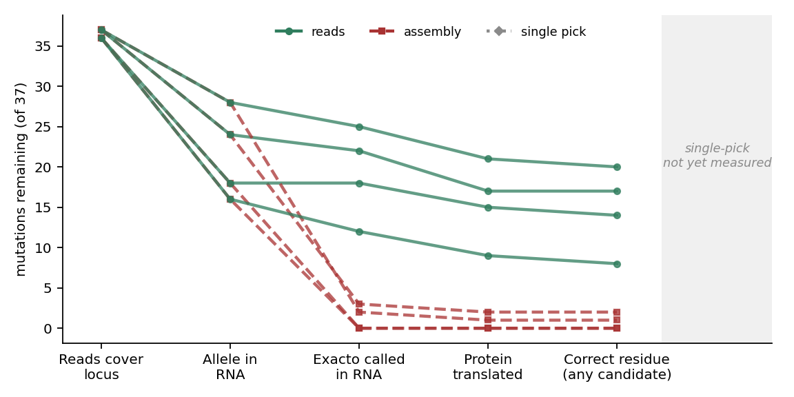
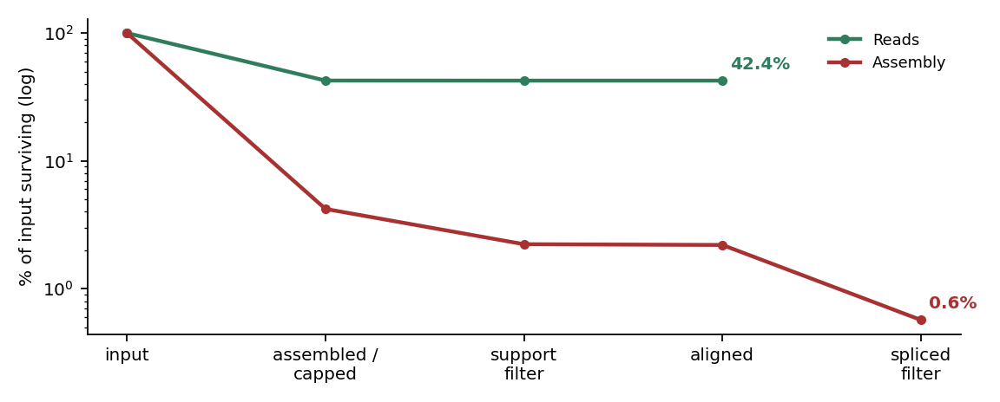
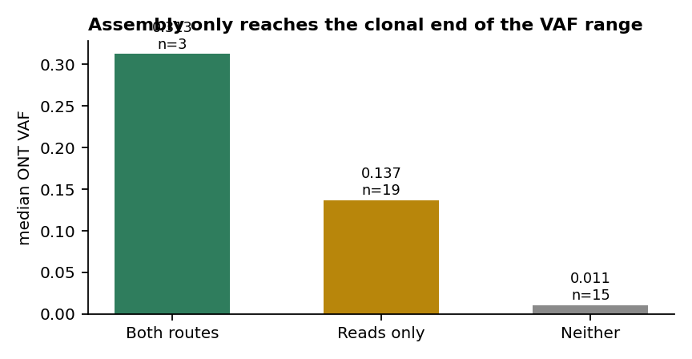
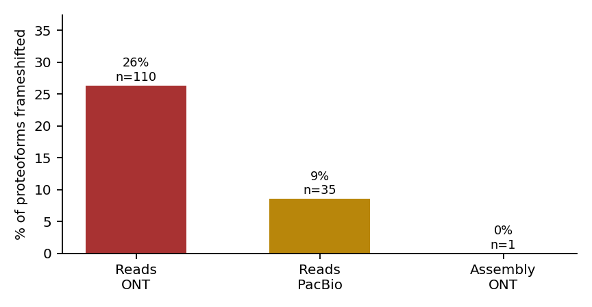
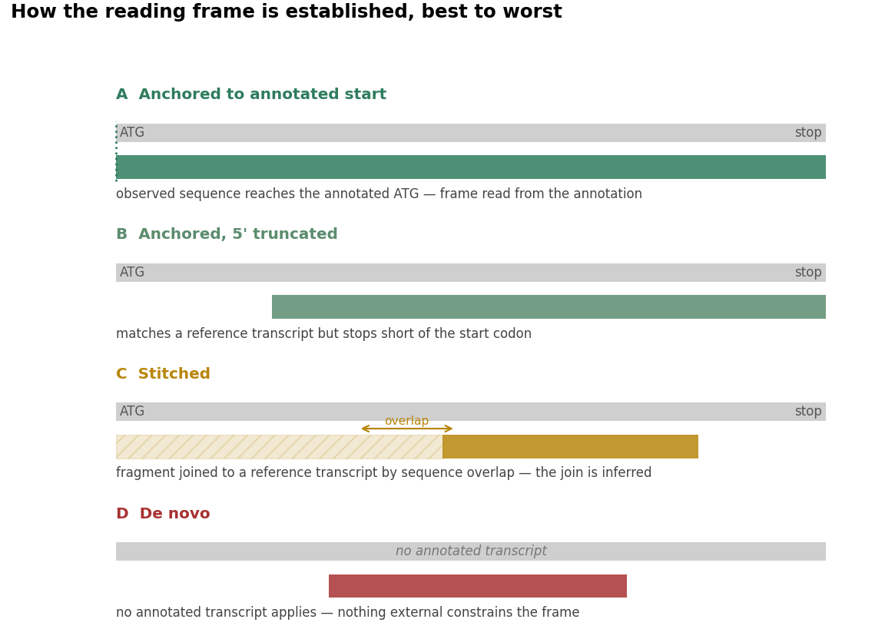

# Notes for the Exacto author

**Sensitivity and specificity of mutant-proteoform recovery, and how the choices
upstream of Exacto dominate both**

Prepared from an independent end-to-end test of Exacto 0.4.6a1 on open data from
[osteosarc.com](https://osteosarc.com). Harness, raw results and every command:
[pirl-unc/DoesExactoWorkYet](https://github.com/pirl-unc/DoesExactoWorkYet) ·
live at [pirl-unc.github.io/DoesExactoWorkYet](https://pirl-unc.github.io/DoesExactoWorkYet/).

---

## 0. What this is, and what it is not

The test asks one narrow question of every mutation: **does a translated mutant
protein sequence come out the other end, and does it match what was actually
manufactured into the patient's vaccine?**

- **Cohort.** 37 somatic mutations from a single osteosarcoma patient, each
  selected into at least one personalised vaccine. 31 SNVs, 6 deletions; 30
  missense, 5 frameshift, 1 intronic, 1 inframe deletion.
- **Samples.** ONT single-cell long-read RNA at three biopsies (T1/T2/T3),
  PacBio Iso-Seq single-cell at T1, Illumina bulk RNA at T2.
- **Ground truth.** The portal's own genotyping of the same BAMs, its HGVS
  protein annotations, and the pVACtools epitope sequences the vaccine designs
  were drawn from — 59 epitopes per variant for 10 of the 37.
- **Scoring.** Every rung is keyed on the RNA variant call Exacto made at the
  mutation's exact locus with its exact allele. Never on `integrate-vars`
  output: that links a DNA variant to anything within 10 kb of a transcript edge
  or 100 kb intergenically, and scoring off it turns 5 recovered mutations into
  28.

**Limitations that bound every claim below.** One patient. No negative controls
— every one of the 37 is a real somatic variant, so this measures sensitivity
and cannot measure false discovery at all (§6 proposes fixing that). No
structural variants, so the breakpoint machinery that motivates Exacto's
two-chromosome variant encoding is entirely untested here. And a handful of
figures rest on 3–5 proteoforms, which is noted where it matters.

---

## 1. Headline

Exacto recovers **22 of 37** vaccine mutations as translated mutant proteins;
**21 of 22** carry the residue the annotation predicts; **8 of 10** mutations
with a published epitope contain that manufactured peptide verbatim.

Of the 15 not recovered, only about 6 are attributable to Exacto:

| | n | attribution |
|---|---|---|
| Deletions called in RNA, never translated | **6** | **Exacto** |
| SNVs with zero alt reads in the portal's own ONT genotyping | 7 | not expressed |
| Intronic (NME1) and one at VAF 0.011 (MYO9A) | 2 | not expected / detection floor |

So on the mutations actually present in the RNA, recovery is 22 of 29 — and the
remaining 7 are one systematic failure mode, not seven separate ones.

---

## 2. The dominant effect is upstream of Exacto

This is the single most important result, and it is not about Exacto's
algorithms.



Two routes to a transcript were run on identical reads:

- **reads** — every variant-spanning read handed over as its own transcript.
- **assembly** — the canonical Nexus `PEPTIDE_PREDICTION_EXACTO` route:
  RNA-Bloom2 → `nexus_filter_rnabloom2_transcripts` → `remove-unspliced-rnas`.

They are identical up to "allele present in the RNA", because they are the same
reads. Then they diverge completely: **assembly loses 87–100% of alleles at the
calling stage; reads loses 8–25%.**

Across all samples: reads recovers 22 mutations, assembly recovers 3, and
**assembly recovers nothing reads does not.** The assembly-only set is empty.



The sequence funnel shows why: 42% of input survives the reads route, 0.6%
survives assembly — roughly half lost at `min-read-support 3`, and ~75% of the
remainder at `remove-unspliced-rnas`.

### 2.1 Mechanism: assembly is a consensus, and neoantigens are subclonal

A contig is built from many reads at a locus. If the mutant allele is a minority
of them, the consensus is the wild-type sequence and the mutation is averaged
away *before Exacto ever sees it*. The VAF profile is the signature:



| recovered by | n | median ONT VAF |
|---|---|---|
| both routes | 3 | 0.313 |
| reads only | 19 | 0.137 |
| neither | 15 | 0.011 |

Assembly reaches only the clonal end of the range. `min-read-support 3` then
compounds it — for a variant at 5% VAF it demands depth the sample may not have
at that locus, and it drops the mutant contig while the wild-type one passes.
The filter is not wrong; its cost simply falls precisely on the variants a
neoantigen pipeline most wants.

**Implication.** For neoantigen discovery specifically, a global de-novo
assembly step is the wrong default. It optimises for transcript completeness at
the cost of allele sensitivity, and subclonal mutations are the target.

---

## 3. What assembly does buy, and why it is not enough

Assembly produces materially cleaner reading frames, and the gradient is exactly
what sequencing error predicts:



| how the transcript was made | proteoforms | frameshifted |
|---|---|---|
| raw ONT reads | 110 | **26%** |
| PacBio Iso-Seq reads | 35 | 9% |
| RNA-Bloom2 contigs | 5 | **0%** |

An indel miscalled in a homopolymer shifts the frame; collapsing many reads into
one contig removes an error present in a minority of them. PacBio sitting
between the two — HiFi reads are already circular-consensus corrected — is what
makes this a gradient rather than a story.

**But the frameshifts largely do not matter for this question.** The residue is
still correct in 59 of 62 checks, and every proteoform that could match a
published epitope did. A frameshift *downstream* of the mutation ruins the tail
of the protein without moving the codon under test. Assembly buys frame
integrity and pays for it with an order of magnitude of recall.

*(Caveat: the assembly frameshift figure rests on 5 proteoforms.)*

---

## 4. Specific issues in Exacto

Ten are filed with reproductions in the harness. The ones that bear on
sensitivity and specificity:

### 4.1 Deletions are called in the RNA and never translated — 0 of 6

The clean split by variant type: **22 of 22 translated variants are SNVs, 0 of 6
deletions.** These are not coverage failures. H1-2 has 2,998 alt reads of 18,173
at T2 and 150 separate RNA calls from Exacto's own caller, and produces no
proteoform on any sample or any arm.

This is the single largest recoverable gap: fixing it takes recall from 22/37 to
28/37, i.e. 28 of the 29 mutations present in the RNA. The harness now
instruments the primary-structures table to distinguish *never referenced the
call* from *referenced it and judged the protein unchanged*, which should
localise it quickly.

### 4.2 `longest_orf` takes its frame from the read alone

All 32 frameshifted proteoforms are attributed to variants Exacto was told are
SNVs of size 1. A substitution cannot shift its own frame, so something else
moved it — either a real frame-shifting variant phased upstream on the same
molecule, which is legitimate and is exactly what long reads are for, or a
miscalled indel.

The platform gradient (§3) says most are read error. The suggestion is not to
guess per case but to remove the ambiguity:

- **Take the frame from the reference CDS** of the transcript the model was
  matched to, and let only *called* variants move it. Read error then cannot
  shift the frame, while a genuine phased upstream indel still does — which is
  the distinction that matters. This would need a strategy alongside
  `longest_orf` and `all_orfs`.
- **The variant class is a free consistency check.** An SNV cannot be the cause
  of its own frameshift; a 3n indel cannot shift the frame; a non-3n indel must.
  Exacto already has `variant_type` and `variant_size` in its own input.

Note this must *not* be implemented as reference-transcript substitution: that
would break exactly the novel-ORF cases (translocation into non-coding sequence,
cryptic exon from an intronic insertion) that motivate Exacto's design. The
frame should come from annotation *where an annotated transcript applies*, and
`longest_orf` remains correct where none does.

### 4.3 Candidate proteoforms are emitted unranked

The reads route hands back a **median of 5 candidate proteins per recovered
mutation, and up to 107**, roughly a quarter of them frameshifted, with no
ranking. A downstream user must choose, and Exacto provides nothing to choose
with.

The harness works around this with a modal-translation rule — basecalling errors
are independent between reads, so a spurious indel appears in one read and
nowhere else while the true sequence recurs — but that is a rule we invented.

**Suggestion:** report **per-proteoform molecule support** — how many
independent reads or UMIs produced each translation. That single field turns an
unranked pile into a ranked one, lets a caller apply their own threshold, and is
the substrate for FDR calibration (§6). It is probably the highest
value-per-effort change on this list.

### 4.4 `call-rna-vars` memory scales with read count

Measured on a 16 GB runner: ~0.55 MB resident per read accumulating linearly,
then a ~6.8 GB allocation in a final burst. Peak ≈ `(0.55 MB × reads) + 6.8 GB`,
putting the ceiling near 15,000 reads — below what a single long-read sample
produces. Confirmed three ways: 18,818 and 19,858 reads both killed the runner;
7,692 completed.

The failure mode is worse than the limit: the runner stops responding, so the
job dies with no error of its own and nothing uploaded. Streaming transcript
models to disk, processing in bounded batches, or simply *documenting the memory
cost per read* would each turn an unexplained three-hour death into a sizing
decision.

### 4.5 Crashes with workarounds

Four more, each with a reproduction: panic on unmapped records
(`bam.rs:892`); `remove-unspliced-rnas` writes records in hash order under an
`SO:coordinate` header so its own indexing step rejects the file it just wrote
(`bam.rs:1315`); `"".split(",")` yielding `[""]` so a call matching no reference
transcript takes the annotated-transcript branch and dies on
`get_transcript("").unwrap()` (`variant_integration.rs:98`); and reads touching
a non-ACGT base being dropped silently (`reference_transcript_sequence.rs:176`).

---

## 5. A sensitivity/specificity framework

One number cannot express this trade-off, and the obvious summary is misleading.
The harness reports four axes per method:

| axis | definition | why |
|---|---|---|
| **sensitivity** | recovered / mutations whose allele is in that sample's RNA | scoring against all 37 punishes a method for what the tumour does not express |
| **right answer present** | any candidate carries the right residue | a *ceiling*, not a result — flatters high-multiplicity methods badly |
| **consensus pick correct** | the modal translation carries it | what a caller gets choosing without knowing the answer |
| **candidates per mutation** | distinct proteins returned per mutation | work the user inherits, since nothing ranks them |

Current figures on the two methods with results, both `any()`-scored:

```
              sensitivity   right-answer-present   in-frame   candidates/variant
reads             0.72              0.94             0.77            5.5
assembly          0.04              1.00             1.00            2.0
```

The `right answer present` column is why this framing matters: a method emitting
one correct proteoform among a hundred wrong ones scores identically to one
emitting a single correct proteoform. Reporting that as precision — as this
harness did until it was caught — overstates both methods.

---

## 6. Calibrated confidence, and FDR of a protein sequence

This is the part I think is most worth Exacto's attention, and the part this
test currently *cannot* do.

### 6.1 The gap: there are no negative controls

Every one of the 37 variants is a real somatic mutation. So the harness measures
sensitivity and **cannot measure false discovery at all**. "22 of 37 recovered"
says nothing about how often Exacto would emit a confident mutant proteoform for
a mutation that is not there.

### 6.2 A decoy design, borrowed from proteomics

Target-decoy is the standard answer and transfers cleanly:

1. For each real variant, generate *k* **decoy variants** — same gene, same
   consequence class, same expected VAF, but at a position with no somatic
   variant, or with the alternate allele permuted to a different base.
2. Run the identical pipeline over targets and decoys together.
3. **Empirical FDR at any threshold** = decoy proteoforms above threshold /
   total proteoforms above threshold.

This is directly implementable in this harness and would convert every claim
above from "sensitivity only" to a proper ROC. It also tests something no
positive-only benchmark can: whether Exacto's transcript-model construction
manufactures plausible mutant proteins from noise, which is precisely the risk
when each of thousands of noisy reads is its own transcript.

### 6.3 How the reading frame was established

Before any of the evidence axes below, there is a prior question that decides
how much any of them are worth: **what fixed the reading frame at all?** A
proteoform whose transcript reaches an annotated start codon has its frame
determined by the annotation, and read error cannot move it. A proteoform from a
novel gene has nothing external constraining it, and `longest_orf` is a guess
that no amount of molecule support can validate.



| tier | evidence | frame determined by | externally checkable? |
|---|---|---|---|
| **A · anchored** | transcript spans back to the annotated start codon of a matched reference transcript | annotation | **yes** — against the reference CDS |
| **B · anchored, 5′-truncated** | matches a reference transcript over enough sequence to fix the frame, but does not reach the start | annotation, plus an inference that the frame is preserved to the 5′ end | partially |
| **C · stitched** | fragment must be joined to a reference transcript by sequence overlap before a frame can be assigned | the inferred join | weakly — a wrong isoform choice changes the frame |
| **D · de novo** | no annotated transcript applies: novel gene, translocation into non-coding sequence, cryptic exon from an intronic insertion | longest-ORF or equivalent | **no** |

Two things follow immediately.

**The tier is largely set by platform and preparation, not by Exacto.**
Full-length long reads — Iso-Seq in particular, which is 5′-complete by
construction via the TSO — land in A. Fragmented long reads and any short-read
assembly land in B or C, because a 200–600 bp contig rarely reaches a start
codon. Illumina is therefore structurally disadvantaged for frame determination
*on top of* the minority-allele blindness in §2.1, and the two compound: it
cannot see the subclonal allele, and when it does it cannot anchor the frame.

**This benchmark almost never exercises tier D, and Exacto lives there.** Of the
145 recovered proteoforms carrying a vaccine mutation, 142 matched an annotated
reference transcript and only 3 did not — unsurprising, since all 37 mutations
are in known protein-coding genes. But across the same runs Exacto made
**969–2,029 RNA calls per sample that matched no reference transcript at all**.
Those calls are precisely tier D, they are the majority of what the tool
produces, and nothing in this test says how well it does there. The class of
variant Exacto's two-chromosome breakpoint encoding exists for is the class this
benchmark cannot score.

That gap matters for the fix suggested in §4.2. "Take the frame from the
reference CDS" is right for tiers A and B, defensible for C if the join is
reported as inferred, and simply unavailable for D — where `longest_orf` remains
the only option and the honest answer is to report *low confidence*, not to
pretend otherwise.

### 6.4 A composite proteoform quality score

Combining the frame provenance above with the other evidence axes gives a score
that can be attached to every proteoform, computed from data Exacto already has
or could cheaply report. Weighted so that frame provenance dominates: a
beautifully supported protein in an unverifiable frame is still a guess.

| feature | 3 | 2 | 1 | 0 | weight |
|---|---|---|---|---|---|
| **Frame provenance** | A · reaches annotated start | B · anchored, truncated | C · stitched by overlap | D · de novo | ×3 |
| **Molecule support** | ≥10 independent molecules give this exact translation | 3–9 | 2 | 1 | ×2 |
| **Frame consistency** | agrees with variant class *and* reference CDS | agrees with variant class | untestable (tier D) | contradicts variant class | ×2 |
| **Platform corroboration** | ≥2 platforms with different error profiles | 2 methods, one platform | single method | — | ×1 |
| **Epitope completeness** | all published epitopes verbatim, spanning the peptide | ≥1 epitope verbatim | mutant residue correct only | codon changed, residue wrong | ×2 |
| **Allele-fraction consistency** | proteoform support within ~1.5× of DNA VAF | within 3× | discordant | — | ×1 |

Maximum 33. Suggested banding, with per-band FDR estimated empirically from the
decoy design in §6.2 rather than asserted:

| band | score | reading |
|---|---|---|
| **High** | ≥26 | frame externally verified, corroborated across molecules and platforms |
| **Medium** | 17–25 | frame anchored or consistent, single line of evidence |
| **Low** | 9–16 | frame inferred or unverifiable, thin support |
| **Speculative** | <9 | de novo frame, single molecule — report, do not act on |

The point of the banding is not the exact cut-offs, which want calibrating
against decoys. It is that **frame provenance is a first-class feature and
currently invisible**. Exacto knows whether a transcript model matched a
reference transcript — it already emits `reference_transcript_ids` — and it
knows whether that model reaches the annotated start. Emitting both per
proteoform would let every consumer compute this table without inventing
anything.

### 6.5 Confidence tiers calibrated to protein sequence

The units that matter clinically are not variant calls but **peptide sequences**
— a neoantigen is wrong if any residue in the epitope is wrong. So tiers should
be calibrated on the protein, not the variant. Candidate evidence axes, all
computable from data Exacto already has or could easily report:

| axis | signal | why it is informative |
|---|---|---|
| **frame provenance** | tier A–D above | decides whether any other axis can be trusted |
| **molecule support** | independent reads/UMIs yielding the *same* translation | errors are independent; truth recurs |
| **frame consistency** | frame agrees with the variant class and with the annotated CDS | catches read-error frameshifts without an oracle |
| **cross-method agreement** | same peptide from reads and from assembly | orthogonal preparation paths |
| **cross-platform agreement** | same peptide from ONT and PacBio | orthogonal error profiles — ONT indels vs PacBio substitutions |
| **epitope completeness** | *all* published epitopes present, spanning the manufactured peptide | requires sequence correct on both sides of the mutation |
| **allele fraction consistency** | proteoform support ≈ DNA VAF | a proteoform at 40% from a 2% VAF variant is suspect |

A workable tiering, with FDR estimated per tier by the decoy design:

- **High** — frame tier A or B, ≥5 independent molecules agree on the exact
  peptide, frame consistent with variant class, seen on ≥2 platforms or methods.
- **Medium** — frame tier A–C, ≥3 molecules agree, single platform.
- **Low** — frame tier C or D, or 1–2 molecules, or frame inconsistent with the
  variant class, or disagreement between methods.

Note that a tier-D proteoform can never reach High under this scheme however
many molecules support it, which is deliberate: molecule support establishes
that the *sequence* is real, not that the *frame* is right. Those are separate
claims and conflating them is how a confidently-wrong neoantigen gets made.

The important design point: **do not filter, stratify.** This test found that
every filter applied so far — `min-read-support 3`, `remove-unspliced-rnas` —
cost more sensitivity than it was worth for subclonal variants. A confidence
tier lets the caller choose; a filter chooses for them, invisibly and in the
wrong direction for this application.

---

## 7. Platform and library considerations

The differences are real and pull in different directions.

### ONT (single-cell, long read)
- **Best recall measured.** Deepest data here, and reads span transcripts.
- **26% of proteoforms frameshifted** — homopolymer indels are the dominant
  error and land exactly where they hurt: the reading frame.
- **UMIs available and under-used.** The portal's BAMs are UMI-*deduplicated*
  (one representative read per molecule), not UMI-*consensus*. A per-UMI
  consensus is the ideal error correction here because the partition is *given*
  rather than inferred — no allele inference, so it cannot collapse alleles.
  Measured limit: 69% of molecules are singletons and only 13% carry ≥3 reads,
  so this helps a minority. Correction across reads of the same *gene*
  (isONcorrect-style) reaches much more of the data.

### PacBio (single-cell Iso-Seq, long read)
- **9% frameshifted** — consensus reads, ~3× cleaner frames than ONT.
- **Shallower**: 7,692 spanning reads against ONT's 18,818 at the same biopsy.
- **`QUAL` is `*` on every record** (`isoseq groupdedup` emits deduplicated
  consensus transcripts). `call-rna-vars` panics without per-base quality, so a
  flat score must be fabricated. Exacto could accept missing `QUAL` explicitly
  rather than requiring callers to invent one.
- Best per-read accuracy per unit of depth; the right platform when frame
  integrity matters more than sensitivity.

### Illumina (bulk, short read)
- A 150 bp read is not a transcript, so raw short reads have no meaningful path
  into Exacto — the README is right about that. Assembled contigs
  (rnaSPAdes/Trinity) do, since Exacto never asks where a sequence came from.
- But short-read assembly inherits **exactly the minority-allele blindness of
  §2.1**, and adds an inability to phase. Expect it to behave like the assembly
  arm, only worse.
- Its real value is orthogonal: high base accuracy for *variant calling*, with
  long reads supplying phasing and isoform assignment. A hybrid design, not a
  substitute.

### Single-cell versus bulk
- **Single-cell gives molecule identity (UMIs)** — the only partition that
  removes error without any allele inference — and cell-level assignment, which
  makes within-cell phasing possible and could distinguish a subclone from an
  artefact.
- **Bulk gives depth**, which is what low-VAF detection actually needs, and no
  molecule identity.
- **Nobody applies a barcode knee here.** Nexus's single-cell route runs
  `find_scrna_barcode_knee` and passes `--min-reads-per-barcode`; this test does
  not, so ambient RNA and empty droplets go in with everything else. Measured
  cost of applying it: drops 61% of barcodes but only **19% of reads**. Likely
  helps the assembly route (fewer spurious low-support contigs) and is pure loss
  for the reads route.

---

## 8. Upstream, in Nexus

Both defaults below are Nexus's own, verified in
`filter_rnabloom2_transcripts.py` — not choices this harness made. Neither is
wrong in general; both look wrong for subclonal neoantigen discovery.

- **`min-read-support 3`** costs ~50% of contigs, and falls hardest on
  low-support *mutant* contigs. A sweep at 1 is now running.
- **`remove-unspliced-rnas`** costs ~75% of what survives. Reading the source,
  it keeps `passing_mapping_quality ∩ has_splicing` — so anything without a
  splice junction is dropped. The intent is right (pre-mRNA, genomic carryover)
  but it cannot distinguish those from a genuinely **single-exon gene**, and
  mitochondrial transcripts have no introns at all. MT-ND5 is one of the 37.
  *Minor observation:* the function builds a `single_exon_transcripts_map` from
  the annotation in Step 1 and does not reference it in Steps 2–8. Either the
  whitelist lives inside `get_read_names_with_splicing`, or it is a partial
  refactor — worth a look.

---

## 9. Suggested priorities

Ordered by expected value per unit of effort:

1. **Report per-proteoform molecule support, and frame provenance.** Both are
   small changes; together they turn an unranked pile into a ranked one and make
   §6.4's quality score computable by any consumer. Provenance needs only two
   flags Exacto already has the information for: did the transcript model match
   a reference transcript, and did it reach that transcript's annotated start
   codon.
2. **Fix deletion translation.** 6 of 37, and the largest single recoverable
   gap.
3. **Add a reference-CDS-anchored translation strategy** alongside `longest_orf`
   and `all_orfs`, applied only where an annotated transcript matches.
4. **Add the variant-class frame consistency check** — free, deterministic, no
   oracle.
5. **Bound `call-rna-vars` memory, or document the per-read cost.**
6. **Reconsider the Nexus defaults for this application** — or better, expose
   them as confidence tiers rather than filters.
7. **Build a decoy arm** to make FDR measurable at all. This is the one that
   converts everything else from anecdote into calibration.

---

## 10. What would change my mind

Stated so these claims are falsifiable:

- If `assembly-ms1` (min read support 1) recovers most of the 19 that only the
  reads route finds, the problem is the *filter*, not assembly, and §2's
  conclusion is too strong.
- If `isonform` — assembly *within* an allele-separated cluster — matches the
  reads route's recall at assembly's frame integrity, then assembly per se is
  fine and only *global* assembly is the problem.
- If the Illumina arm performs comparably, the long-read requirement is about
  assembly rather than about reads, and the framing in §7 is wrong.
- If the deletion failure turns out to be in the harness's evaluator rather than
  in `translate-structs`, §4.1 is my bug and not Exacto's.

All four are running or instrumented as of this writing.
